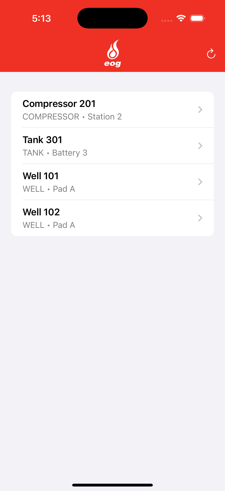
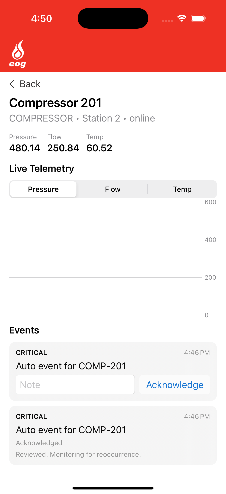

# OpsPulse

OpsPulse is a SwiftUI iOS app + Node/Express backend demo focused on **operational awareness**:

- Browse a fleet of operational assets (wells, compressors, tanks, etc.)
- Drill into a single asset for live telemetry
- Review asset events and acknowledge them with an optional operator note

It’s designed to model a lightweight “ops dashboard” experience suitable for field/operations teams.

Project layout:

- iOS app: `OpsPulse/` (SwiftUI + SwiftData)
- Backend: `backend/` (Express + WebSocket STOMP-style topics)

## Screenshots

| Asset List                        | Asset Detail                        |
| --------------------------------- | ----------------------------------- |
|  |  |

### Demo video

[OpsPulse Demo (MP4)](assets/opspulse-demo.mp4)

[OpsPulse Demo (YouTube)](https://youtube.com/shorts/CM99nE12xMo?feature=share)

## What the app does (functional overview)

### Asset fleet view

- Shows a list of assets persisted locally via SwiftData.
- Pull-to-refresh is implemented as a refresh action in the header.
- On first launch (or when empty) the app fetches assets from the backend.

### Asset detail view

- Displays key identity/status for the asset.
- Streams live telemetry via WebSocket subscription.
- Shows a chart of telemetry (pressure/flow/temp) with a segmented picker.
- Shows a list of events for the asset.

### Event acknowledgement

- Each event can be acknowledged.
- An optional note can be recorded at acknowledgement time.
- Acknowledged events display an “Acknowledged” state and the saved note.

### App locking

- App starts locked and requires device authentication to enter.
- Uses biometrics when enrolled; falls back to device passcode when available.

## Key features

- **SwiftUI UI** with a branded header and consistent navigation patterns.
- **SwiftData persistence** for assets/events.
- **REST API integration** to fetch the asset list.
- **Live updates** using WebSockets with STOMP-style topic destinations.
- **Authentication gate** using `LocalAuthentication`.

## User flows

1. Launch app
2. Authenticate (Face ID / Touch ID / passcode)
3. View asset list
4. Tap an asset
5. View telemetry + events
6. Acknowledge an event with an optional note

## Architecture (high level)

### iOS app

- **Entry point:** `OpsPulseApp.swift` → `LockGateView`
- **Lock/auth:** `AuthManager.swift` (LocalAuthentication) + `LockGateView.swift`
- **Backend endpoints:** `BackendConfig.swift`
- **REST client:** `APIClient.swift`
- **WebSocket:** `STOMPClient.swift` (topic subscribe)
- **Data model:** `Models.swift` (`AssetEntity`, `EventEntity`)
- **Screens:** `OpsPulseViews.swift`

The app stores backend responses into SwiftData (`AssetEntity` / `EventEntity`) so the UI can be driven by `@Query`.

### Backend

- Node + Express server providing:
  - Health check
  - Asset endpoints
  - A WebSocket endpoint broadcasting telemetry + events

## Requirements

- Xcode (iOS app)
- Node.js (backend)

## Run the backend (local)

From the `backend/` folder:

```bash
npm install
npm run dev
```

Backend URLs (default):

- HTTP: `http://localhost:3000`
- WebSocket: `ws://localhost:3000/ws`

### Backend endpoints

- `GET /health`
- `GET /api/assets`
- `GET /api/assets/:id`

### WebSocket (STOMP-style topics)

- URL: `ws://localhost:3000/ws`
- Destinations:
  - `/topic/telemetry.<ASSET_ID>`
  - `/topic/events.<ASSET_ID>`

## Authentication (biometrics / passcode)

The app uses `LocalAuthentication` to lock/unlock.

- If biometrics are available/enrolled, it will use Face ID / Touch ID.
- Otherwise it will fall back to device passcode (if enabled).

## Notes

- This project stores a demo auth token in Keychain for demonstration purposes.
- SwiftData is used for local persistence.
